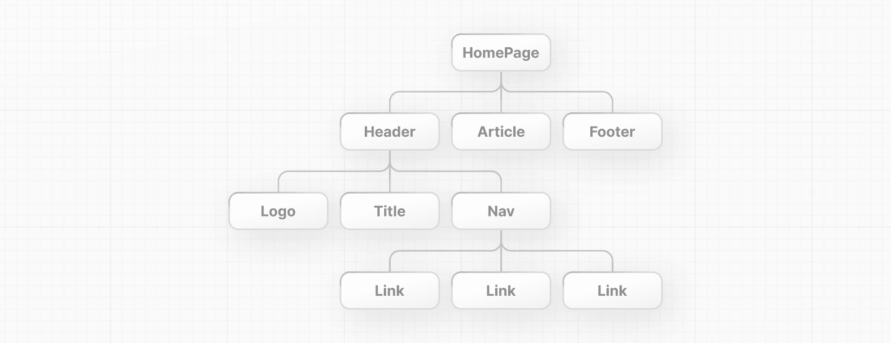

# Imperative vs. declarative programming

To create a Pizza
 - imperative programming - giving steps by step to chef is 
 - declarative programming - ordering a pizza and chef making it is
 
 So, 
 1. Writing JavaScript manipulations like CreateElement, element.AppendElement etc. is imperative programming.
 2. React is A declarative UI library: instead of writing everything, we can ask React to create an H1 with a text.
    - ```<script src="https://unpkg.com/react@18/umd/react.development.js"></script>```
    - ```<script src="https://unpkg.com/react-dom@18/umd/react-dom.development.js"></script>```
    
## React vs Normal JavaScript based

Doing the same thing with both technologies - adding a header to doc.

### React with JSX (JS extension)

```js
<script type="text/jsx">
  const domNode = document.getElementById('app');
  const root = ReactDOM.createRoot(domNode);
  root.render(<h1>Develop. Preview. Ship.</h1>);
</script>
```

### Normal JavaScript

```js
<script type="text/javascript">
  const app = document.getElementById('app');
  const header = document.createElement('h1');
  const text = 'Develop. Preview. Ship.';
  const headerContent = document.createTextNode(text);
  header.appendChild(headerContent);
  app.appendChild(header);
</script>
```

## React has 3 concepts
1. Components
2. Props
3. State

## 1. React Components

React Component is a JavaScript function that returns a UI element in the return statement (with JSX). Then you can use that UI element as a HTML tag inside HTML.

```js
<script type="text/jsx">
    function Header() { // must be capital
      return <h1>Develop. Preview. Ship.</h1>;
    }
    const root = ReactDOM.createRoot(app);
    // Capitalize the React Component
    root.render(<Header />);
</script>
```

You can use this approach to create a model for your website.

e.g.: Following is an example how components can be created & organized


Above HomePage component has 3 child elements, Header, Articles and Footer.  Header has Logo, Title and Nav etc. 

## 2. React Props

You can pass pieces of information as properties to React components. These are called props. Similar to a JavaScript function, you can design components that accept custom arguments (or props) that change the component.

*Note:* In React, data flows down the component tree. This is referred to as one-way data flow.

## 2. React State

TODO

# Next.js - How to

1. For Next.js, the main file is app/page.js
Create it.

```jsx
function Header({ title }) { // caps
  return <h1>{title ? title : "Default title"}</h1>
}

export default function HomePage() {

  const names = ["Ada Lovelace", "Grace Hopper", "Margaret Hamilton"]

  return (
    <div>
      <Header title="Develop. Preview. Ship." />
      <ul>
        {names.map((name) => (
          <li key={name}>{name}</li>
        ))}
      </ul>
    </div>
  )
}
```

2. Install required dependencies

```
npm install react@latest react-dom@latest next@latest
```

This generates following files/directories.

- node_modules
    - this has all the dependency libraries
- package.json 
    - file has all the dependencies.
- package-lock.json file 
    - that contains detailed information about the exact versions of each package.


With the above `npm install`, package.json gets followings.

```json
{
  "dependencies": {
    "next": "^15.5.4",
    "react": "^19.1.1",
    "react-dom": "^19.1.1"
  }
}
```

3. Live changes - Running it as a development server

Add scripts to package.json manually

```json
{
  "scripts": {
    "dev": "next dev"
  },
  "dependencies": {
    "next": "^14.0.3",
    "react": "^18.3.1",
    "react-dom": "^18.3.1"
  }
}
```

Now, run this in `dev` mode. 

`npm run dev`
OR
`yarn run dev`

__Note__: No any difference in npm or yarn, it is (yarn) only a faster tool.

A .next directory is created 
A new file called /app/layout.js is auto generated with below content, this is the main layout of an app.

```js
export const metadata = {
  title: 'Next.js',
  description: 'Generated by Next.js',
};
 
export default function RootLayout({ children }) {
  return (
    <html lang="en">
      <body>{children}</body>
    </html>
  );
}
```

Application is running in http://localhost:3000

4. Generate Static Site & View

For that, first generated the static site by adding a script to build the site into package.json.

```json
{
  "scripts": {
    "dev": "next dev",
    "build": "next build" # next build is the command
  },
  "dependencies": {
    "next": "^15.5.4",
    "react": "^19.1.1",
    "react-dom": "^19.1.1"
  }
}
```
Now, generate it.

`yarn build` or `npm build`

This generates a `./out` directory with static site.

You can copy this to S3 or any other location.

To check locally, start a http-server and see.

`npx http-server ./out`

This will start a server at 8080 port.

